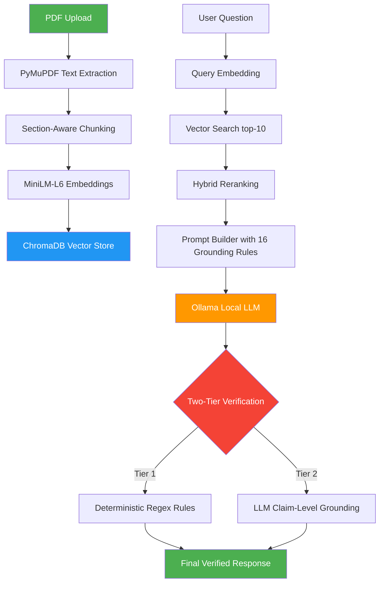

# InsureLens

**Private, evidence-grounded AI for insurance understanding.**

InsureLens is a privacy-first, local AI application that helps users understand their insurance policies. Users upload PDF policies, ask questions, and receive evidence-grounded answers with page-level citations. Everything runs locally — no data leaves your machine.

## 🚀 Features

- **Document Indexing**: Extracts and chunks text from uploaded PDF policies, storing them in a local vector database.
- **Q&A System (RAG)**: Ask specific questions (e.g., "What are the waiting periods?") and receive answers based on retrieved clauses.
- **Policy Briefing**: Automatically analyzes the document to extract and summarize key areas such as coverage, exclusions, waiting periods, and deductibles.
- **Two-Tier Verification**: Combines deterministic regex rules with LLM claim-level semantic grounding to verify factual claims and prevent hallucinations.
- **Privacy First**: Fully local processing using Ollama (LLM) and ChromaDB (Vector Store).

## 🏗 Architecture



## 🛠 Tech Stack

- **Backend**: FastAPI (Python)
- **Frontend**: Streamlit
- **LLM**: Ollama (Local, default model: `qwen2.5-coder:7b`)
- **Vector DB**: ChromaDB
- **Embeddings**: sentence-transformers (`all-MiniLM-L6-v2`, 384-dim)
- **PDF Parsing**: PyMuPDF (`fitz`)

## ⚙️ Setup & Installation

### Prerequisites
- Python 3.10+
- [Ollama](https://ollama.com/) installed and running locally.

### 1. Install Dependencies
```bash
python -m venv .venv
source .venv/bin/activate
pip install -r requirements.txt
```

### 2. Pull the LLM Model
```bash
ollama pull qwen2.5-coder:7b
```

### 3. Environment Configuration
Copy the example environment file and adjust if necessary:
```bash
cp .env.example .env
```

### 4. Run the Application
Start the FastAPI backend:
```bash
uvicorn app.main:app --reload --port 8000
```
In a new terminal, start the Streamlit frontend:
```bash
streamlit run ui/streamlit_app.py
```

## 📡 API Endpoints

- `GET /health` — Check API and Ollama connectivity.
- `POST /upload` — Upload and index a PDF policy.
- `POST /ask` — Ask a question about an indexed policy.
- `POST /analyze` — Get a full intelligence briefing of the policy.

## 🧠 Key Design Decisions

- **Privacy-first**: All processing is strictly local.
- **Application-controlled citations**: Sources are generated by the backend retriever, NOT by LLM output, preventing hallucinated citations.
- **Numeric grounding validation**: Cross-checks that every number in LLM claims exists in the source chunks.
- **Smart query routing**: Broad review questions automatically redirect from Q&A to the full intelligence briefing.

## 🚧 Known Limitations & Roadmap

- **Deterministic Verification Rules**: The current `deterministic.py` relies on hardcoded rules based on a benchmark policy. Future updates will dynamically extract these constraints during indexing.
- **Document Chunking**: The `MAJOR_SECTIONS` list in `chunker.py` is tailored to a specific policy structure.
- **PDF Extraction**: Currently lacks table structure extraction.
